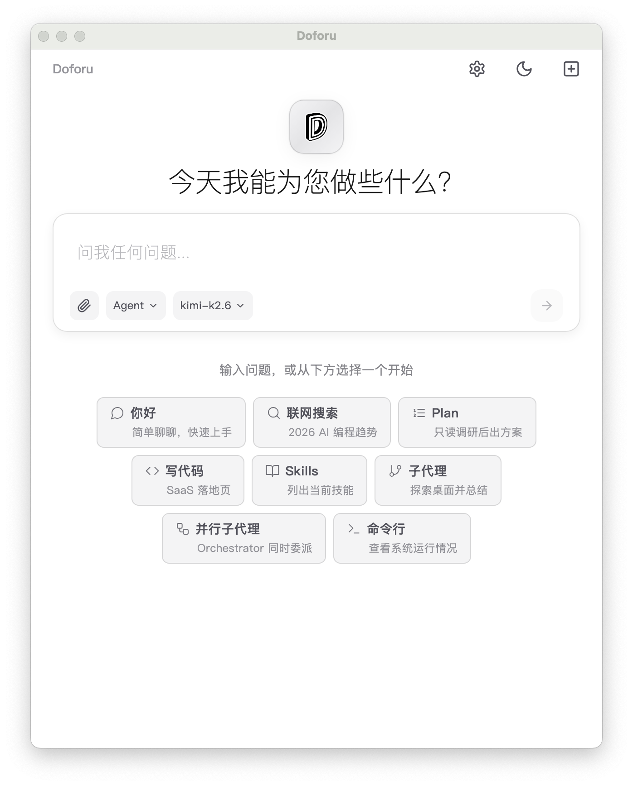

  <b>🇨🇳 简体中文</b> · <a href="./README_EN.md">🇺🇸 English</a>

  

<h1 align="center" style="border-bottom: none;">Doforu</h1>

  <strong>一句话，开启 Agent 智能编排</strong> 
  说出需求，Doforu 即时拆解并编排多 Agent 并行执行—— 
  编程、分析、写作，一句话拿到完整交付物。

  
  
  
  

  <b>首次发布</b> · 
  <b>可自定义 Skills</b> · 
  <b>100%</b> 本地隐私 · 
  <b>自带 API Key，零中间商</b>

> 💡 **本仓库为 Doforu 官方文档与社区反馈中心。** Doforu 是闭源商业软件，代码不对外开放。欢迎通过 [Issue](https://github.com/yctech2026/Doforu-APP/issues) 提交反馈与功能建议。

## 核心概念

**你说一句话 → Doforu 拆解任务 → 多 Agent 并行执行 → 交付完整成果**

无需 Prompt 工程，无需切换工具。主 Agent 动态召集子 Agent 同时开工，自动分工、协作、交付。

> **[观看演示](https://www.doforu.ai/demo)**

  

## 适用场景

| 角色 | 典型场景 | 示例指令 | Doforu 交付 |
|------|---------|---------|------------|
| **开发者** | 全栈开发、自动修复、重构、写测试 | "做一个带登录的待办应用，React + TS，支持暗黑模式。" | 可 `npm run dev` 的完整项目 |
| **产品经理** | PRD 撰写、数据分析、可交互原型 | "分析上季度留存数据，输出带图表的分析报告。" | 清洗后的 CSV + 可视化图表 + 报告 |
| **运营 / 分析师** | 数据清洗、可视化、文案批量生成 | "写 5 条温暖治愈的小红书文案，带 emoji。" | 可直接发布的 5 条文案 + 备选标题 |
| **独立创始人** | 从想法到可演示的 MVP | "做一个展示我们 SaaS 产品的落地页，包含定价和团队介绍。" | 可部署的静态网站 + 文案 |

> 一次运行背后：主 Agent 自动评估复杂度 → 轻量任务交给 `fast` SubAgent，深度任务交给 `extreme` SubAgent → 多 SubAgent 同一轮并行执行 → 自动纠错、汇总交付。

## 核心能力

- **Orchestrator 智能编排** — 接收你的指令，理解意图、评估复杂度，将任务拆解为可并行的子任务，动态分发给最合适的子 Agent
- **Plan 秒级规划** — 分析你的需求，输出完整的执行蓝图（拆解步骤、工具选择、预估耗时），确认后手动切换 Agent 或 Orchestrator 模式执行
- **Agent 并行执行** — 多个子 Agent 同时开工，各负其责，自动纠错、协作、汇总，交付完整成果
- **可进化的 Skills** — 一句话创建或优化专属 Skill，教一次终身复用，团队越用越懂你
- **MCP 生态集成** — 无缝对接数据库、Figma、Slack、GitHub 等外部工具
- **桌面级原生体验** — 本地文件系统直接读写，深度集成开发环境

## 产品对比

| 能力 | Cursor | Claude Code | Doforu |
|------|--------|-------------|--------|
| 产品形态 | AI 编程 IDE（VS Code 分支） | 终端 CLI 编码 Agent | **桌面级 Agent 智能编排器** |
| 完成复杂任务 | Agent 模式逐步执行 | 单线程终端交互 | **一句话，多 Agent 并行交付** |
| 自动执行 | 代码编辑 + 终端操作 | 文件读写 + 命令执行 | **自动写入文件、运行、修复、出报告** |
| 自定义工作流 | 依赖 `.cursorrules` 配置 | 通过对话上下文调整 | **自然语言定义 Skills，永久复用** |
| 模型支持 | 闭源模型（GPT/Claude 等） | 仅限 Claude 系列 | **国内外 15+ 模型 + 本地模型** |
| 计费方式 | 按 Premium Request（~1.6 次/天 Free） | 按 API Token 消耗 | **仅收平台使用费，API 费用直付厂商** |
| 非开发者友好 | 面向开发者 | 面向开发者 | **一句话，任何人都能用** |

## 安装与启动

### 系统要求

| 系统 | 最低版本 | 芯片 | 推荐配置 |
|------|---------|------|---------|
| macOS | 12 (Monterey)+ | Apple Silicon / Intel | 8 GB 内存，2 GB 磁盘空间 |
| Windows | Windows 10+ | x64 / ARM64 | 8 GB 内存，2 GB 磁盘空间 |

### 下载安装

**方式一：官网（推荐）**

1. 访问 [www.doforu.ai/zh](https://www.doforu.ai/zh)
2. 点击「立即下载」，选择对应系统版本
3. 安装并启动应用

**方式二：GitHub Releases**

1. 前往 [Releases 页面](https://github.com/yctech2026/Doforu-APP/releases)
2. 下载最新版安装包：
   - macOS: `Doforu-3.5.0-universal.dmg`
   - Windows: `Doforu-3.5.0-x64.exe`
3. 运行安装程序

### 首次启动

1. **macOS**：打开 `.dmg`，将 Doforu 拖入「应用程序」文件夹，首次启动时需在「系统设置 → 隐私与安全性」中允许打开。
2. **Windows**：运行安装包，按向导完成安装，启动后防火墙提示请允许网络访问（用于直连模型厂商 API）。
3. 首次打开后，选择你要使用的模型并填入 API Key，按提示完成初始化配置。

## 快速上手

安装完成后，在主界面输入框中用自然语言描述你的任务：

> "做一个带登录的待办应用，React + TypeScript，支持暗黑模式。"

### 第一步：选择运行模式

根据你的需求选择执行方式：

| 模式 | 适合场景 | 说明 |
|------|---------|------|
| **Plan** | 想先看方案再执行 | 分析需求，输出完整的执行蓝图（拆解步骤、工具选择、预估耗时），确认后再运行 |
| **Agent** | 简单任务快速执行 | 直接运行，单 Agent 完成，适合文案生成、代码片段、简单查询等轻量任务 |
| **Orchestrator** | 复杂任务多 Agent 协作 | 主 Agent 自动拆解任务，调度多个子 Agent 并行执行，适合全栈开发、代码重构、深度分析、多文件协作 |

> 💡 不确定选哪个？直接用 **Orchestrator**，它会自动评估复杂度：轻量任务交给 `fast` SubAgent，深度任务交给 `extreme` SubAgent，无需手动选择。

### 第二步：查看执行进度

对话流实时展示执行全过程：
- **AI 回复流** — 逐字输出思考过程和结果内容
- **工具调用卡片** — 每个工具（读文件、写代码、执行命令、调用 SubAgent 等）以卡片形式展示，点击可查看参数和返回结果
- **状态指示** — 底部状态栏显示当前运行模式（Agent / Plan / Orchestrator running...）
- **随时中断** — 点击底部「停止」按钮可立即终止当前任务

### 第三步：验收与迭代

任务完成后，结果已在对话流中完整呈现：
- **输出总结** — 任务完成后，AI 自动汇总交付成果与关键结论
- **文件变更** — 写文件、编辑文件操作会显示行数变更摘要（+N −M）
- **截图保存** — 悬停在任意 AI 回复上，点击右下角按钮可将该回复保存为 PNG 图片
- **继续迭代** — 直接在底部输入框发送新指令，基于当前上下文继续优化或开启新任务

**现在就去试试吧 👉 [www.doforu.ai/zh](https://www.doforu.ai/zh)**

## 版本与定价

| 能力 | Free | Pro |
|------|------|-----|
| **完整任务运行** | **15 次/天** | **300 次/天** |
| Plan 模式（任务规划） | ✓ | ✓ |
| 自定义 Skills | ✓ | 无限 |
| 长期 Memory | — | ✓ |
| MCP 连接数 | 1 个 | 无限 |
| 上下文压缩 | 延迟触发 | 主动优化 |

Pro 版定价：[www.doforu.ai/pricing](https://www.doforu.ai/pricing)

## 系统与模型

**支持系统**：macOS 12+ · Windows 10+

**支持模型**：

- **国外**：OpenAI（GPT-5.5、GPT-5.4、o3）· Anthropic（Claude Opus 4.7、Claude Sonnet 4.5）· Google（Gemini 3.1）· DeepSeek（DeepSeek V4）
- **国内**：阿里通义千问（Qwen 3.6）· 字节豆包 · 月之暗面 Kimi · 百度文心（ERNIE 5.0）· 智谱 GLM · 讯飞星火 · 百川 · 商汤 senseChat
- **本地**：兼容 OpenAI API 的本地模型（Ollama、vLLM 等）

**隐私与成本**：100% 本地运行，API Key 由你保管、直连厂商。Doforu 仅对客户端平台使用按完整任务运行次数收费；API 调用费用由你直接付给厂商，Doforu 不中转、不抽成、不赚差价。

## 获取帮助

- [文档中心](https://www.doforu.ai/docs) — 即时自助
- [GitHub Issues](https://github.com/yctech2026/Doforu-APP/issues) — 问题反馈与功能建议
- 企业微信 / 钉钉 — 企业版 4 小时内

[创建 Issue 提交反馈](https://github.com/yctech2026/Doforu-APP/issues) · [更新日志](https://www.doforu.ai/changelog)

## 常见问题

### Free 版每天能运行多少？

**15 次完整任务运行 / 天** — 一次运行 = 从需求到交付的完整工作流。

| 你每天可以 | 相当于 |
|-----------|--------|
| 写 **3–5** 个完整前端页面 | 含需求分析 + 组件选型 + 代码 + 样式调试 + 自测修复 |
| 生成 **5–8** 个工具脚本 | 含逻辑设计 + 边界处理 + 错误修复 + 使用说明 |
| 产出 **2–3** 份数据分析报告 | 含数据清洗 + 可视化图表 + 洞察总结 |
| 完成 **3–5** 个技术调研课题 | 含信息搜索 + 多源对比 + 方案评估 |

### Doforu 的下一步路线图是什么？

- **2026.04 — 多 Agent 并行编排正式发布（已发布）**  
  Orchestrator 纯协调者模式已落地，支持 `fast`/`extreme` 双类型 SubAgent 并行执行，SSE 实时推送子代理进度与耗时统计。

- **2026.06 — Pro 版正式上线**  
  额度管控与机器码授权等基础设施已就绪，Pro 版将解锁更高日额度等高级能力。

- **2026.Q3 — 团队工作区、共享 Skills**  
  Skills 已支持本地目录管理与 Claude Code 兼容格式，团队版将开放工作区协作与 Skills 共享。

## 企业采购

欢迎企业团队采购与定制合作，请发送邮件至 **alex@yichaotech.com.cn**，我们将在 1 个工作日内回复。

## 许可

本软件为闭源商业软件，版权归 Doforu 所有，保留一切权利。未经授权，禁止反编译、反向工程、分发或衍生开发。

© 2026 Doforu. All rights reserved.
