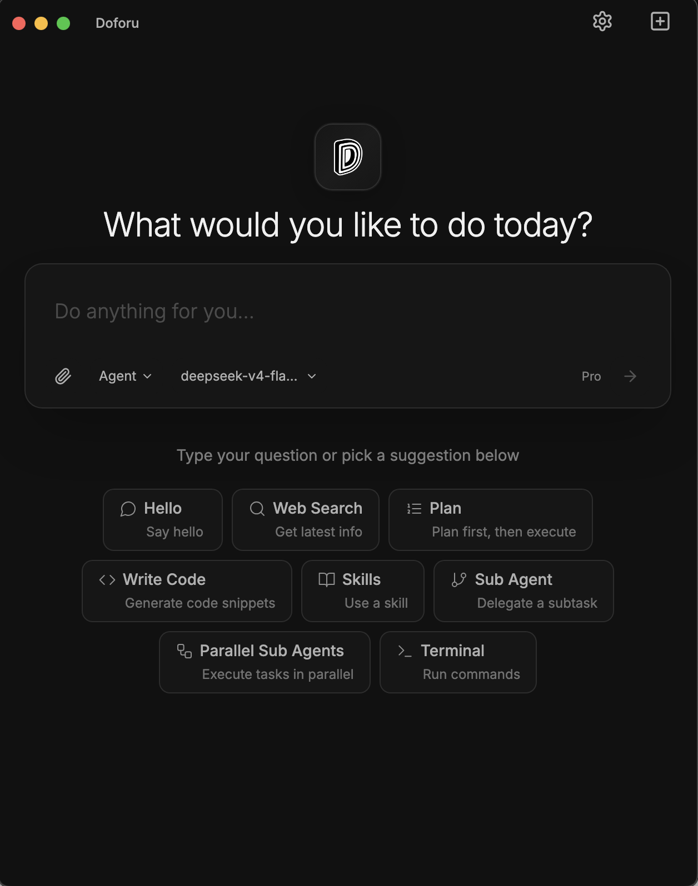

  👉 <a href="https://doforu.ai/ko"><b>doforu.ai</b></a>

  <a href="./README.md">🇺🇸 English</a> · 
  <a href="./README_CN.md">🇨🇳 Chinese</a> · 
  <a href="./README_JA.md">🇯🇵 日本語</a> · 
  <b>🇰🇷 한국어</b>

  

<h1 align="center" style="border-bottom: none;">Doforu</h1>

  <strong>한 문장으로 멀티 Agent 실행을 오케스트레이션하세요</strong> 
  필요한 것을 설명하기만 하면 — Doforu가 즉시 작업을 분석하고 여러 Agent를 병렬로 실행합니다. 
  코딩, 분석, 글쓰기 — 한 번에 완전한 결과물을 받아보세요.

  
  
  
  

  <b>최초 릴리스</b> · 
  <b>맞춤형 Skills</b> · 
  <b>100%</b> 로컬 프라이버시 · 
  <b>자체 API Key 사용</b>

> 💡 **이 저장소는 Doforu의 공식 문서 및 커뮤니티 피드백 허브입니다.** Doforu는 클로즈드 소스 상용 제품입니다. 소스 코드는 공개되어 있지 않습니다. 피드백 및 기능 요청은 [Issues](https://github.com/yctech2026/Doforu-APP/issues)를 통해 제출해 주세요.

## 핵심 개념

**한 문장을 말하면 → Doforu가 작업을 분석 → 여러 Agent가 병렬로 실행 → 완전한 결과물 제공**

프롬프트 엔지니어링이 필요 없습니다. 도구를 전환할 필요도 없습니다. 메인 Agent가 동적으로 하위 Agent를 구성하여 동시에 작업합니다 — 자동으로 작업을 분담하고 협업하여 결과물을 제공합니다.

> **[데모 보러가기](https://www.doforu.ai/demo)**

  

## 사용 사례

| 역할 | 일반적인 시나리오 | 예시 프롬프트 | Doforu 제공 결과물 |
|------|-----------------|---------------|----------------|
| **개발자** | 풀스택 개발, 자동 수정, 리팩토링, 테스트 | "로그인 기능이 있는 React + TypeScript, 다크 모드 지원 할일 앱 만들어줘" | `npm run dev`로 바로 실행 가능한 완전한 프로젝트 |
| **프로젝트 매니저** | PRD 작성, 데이터 분석, 인터랙티브 프로토타입 | "지난 분기 리텐션 데이터를 분석하고 차트가 포함된 보고서를 출력해줘" | 정리된 CSV + 시각화 자료 + 분석 보고서 |
| **운영 / 분석가** | 데이터 정리, 시각화, 대규모 카피라이팅 | "이모지가 포함된 따뜻하고 힐링되는 샤오홍슈(Red) 게시글 5개를 작성해줘" | 게시 가능한 5개 포스트 + 대체 제목 |
| **인디 창업자** | 아이디어에서 데모 준비 MVP까지 | "SaaS 제품의 가격 및 팀 섹션이 포함된 랜딩 페이지를 만들어줘" | 배포 가능한 정적 사이트 + 카피 |

> 모든 실행의 배경: 메인 Agent가 자동으로 복잡성을 평가 → 가벼운 작업은 `fast` 하위 Agent로, 깊이 있는 작업은 `extreme` 하위 Agent로 → 동일 라운드에서 여러 하위 Agent가 병렬 실행 → 자동 수정 및 통합 결과물 제공.

## 핵심 기능

- **Orchestrator 지능형 디스패치** — 사용자 명령을 수신, 의도 파악, 복잡성 평가, 작업을 병렬 하위 작업으로 분할, 가장 적합한 하위 Agent에 동적으로 할당
- **Plan 즉시 계획 수립** — 요구사항을 분석하여 완전한 실행 청사진(단계, 도구 선택, 예상 시간)을 출력. 수동으로 확인 후 Agent 또는 Orchestrator 모드로 전환하여 실행
- **Agent 병렬 실행** — 여러 하위 Agent가 동시에 작업, 각자 담당 부분을 처리하며 오류를 자동 수정, 협업, 결과를 통합하여 완전한 결과물 제공
- **진화하는 Skills** — 한 문장으로 맞춤형 Skills를 생성하거나 개선. 한 번 가르치면 영원히 재사용. 팀이 사용할수록 더 잘 이해하게 됨
- **MCP 에코시스템 통합** — 데이터베이스, Figma, Slack, GitHub 등 외부 도구와 원활하게 연결
- **데스크톱 네이티브 경험** — 로컬 파일 시스템에 직접 읽기/쓰기, 개발 환경과 깊이 통합

## 제품 비교

| 기능 | Cursor | Claude Code | Doforu |
|------------|--------|-------------|--------|
| 제품 형태 | AI 코딩 IDE (VS Code 포크) | 터미널 CLI 코딩 Agent | **데스크톱 Agent Orchestrator** |
| 복잡한 작업 처리 | Agent 모드 단계별 처리 | 단일 스레드 터미널 상호작용 | **한 문장, 멀티 Agent 병렬 결과물 제공** |
| 자동 실행 | 코드 편집 + 터미널 | 파일 I/O + 명령어 실행 | **파일 자동 쓰기, 실행, 수정, 보고서 생성** |
| 맞춤형 워크플로우 | `.cursorrules` 설정에 의존 | 대화 컨텍스트를 통해 조정 | **자연어로 정의된 Skills, 영구적으로 재사용 가능** |
| 모델 지원 | 독점 (GPT/Claude 등) | Claude 전용 | **15개 이상 국내외 모델 + 로컬 모델** |
| 요금제 | Premium Request당 (~1.6회/일 Free) | API 토큰 소비 기준 | **플랫폼 수수료만 부과, API 비용은 제공업체에 직접 지불** |
| 비개발자 친화성 | 개발자 중심 | 개발자 중심 | **한 문장으로 누구나 사용 가능** |

## 설치 및 시작

### 시스템 요구사항

| OS | 최소 버전 | 아키텍처 | 권장 사양 |
|----|-----------------|--------------|-------------|
| macOS | 12 (Monterey)+ | Apple Silicon / Intel | 8 GB RAM, 2 GB 디스크 공간 |
| Windows | Windows 10+ | x64 / ARM64 | 8 GB RAM, 2 GB 디스크 공간 |

### 다운로드 및 설치

**방법 1: 공식 웹사이트 (권장)**

1. [www.doforu.ai/ko](https://www.doforu.ai/ko) 방문
2. "지금 다운로드" 클릭 후 시스템 버전 선택
3. 앱 설치 및 실행

**방법 2: GitHub Releases**

1. [Releases 페이지](https://github.com/yctech2026/Doforu-APP/releases)로 이동
2. 최신 패키지 다운로드:
   - macOS: `Doforu-3.5.0-universal.dmg`
   - Windows: `Doforu-3.5.0-x64.exe`
3. 설치 프로그램 실행

### 첫 실행

1. **macOS**: `.dmg` 파일을 열고 Doforu를 Applications 폴더로 드래그합니다. 첫 실행 시 **시스템 설정 → 개인정보 보호 및 보안**에서 허용해야 합니다.
2. **Windows**: 설치 프로그램을 실행하고 마법사를 따릅니다. 방화벽 알림이 뜨면 네트워크 액세스를 허용합니다 (모델 제공업체 API에 직접 연결하는 데 사용됨).
3. 처음 열면 선호하는 모델을 선택하고 API Key를 입력한 후 안내에 따라 초기 설정을 완료합니다.

## 빠른 시작

설치 후 메인 인터페이스 입력창에 자연어로 작업을 설명하세요:

> "로그인 기능이 있는 React + TypeScript, 다크 모드 지원 할일 앱 만들어줘"

### 1단계: 실행 모드 선택

필요에 따라 실행 방법을 선택하세요:

| 모드 | 최적 사용场景 | 설명 |
|------|----------|-------------|
| **Plan** | 계획을 먼저 확인하고 싶을 때 | 요구사항 분석, 완전한 실행 청사진 출력 (단계, 도구 선택, 예상 시간). 확인 후 실행 |
| **Agent** | 간단한 작업, 빠른 실행 | 단일 Agent로 직접 실행. 카피라이팅, 코드 스니펫, 간단한 질문에 적합 |
| **Orchestrator** | 복잡한 작업, 멀티 Agent 협업 | 메인 Agent가 자동으로 작업을 분석하여 여러 하위 Agent를 병렬로 실행. 풀스택 개발, 리팩토링, 심층 분석, 다중 파일 협업에 최적 |

> 💡 무엇을 선택해야 할지 모르겠다면? **Orchestrator**를 사용하세요. 복잡성을 자동 평가합니다: 가벼운 작업은 `fast` 하위 Agent로, 깊이 있는 작업은 `extreme` 하위 Agent로 — 수동 선택 불필요.

### 2단계: 실행 모니터링

대화 스트림에 전체 실행 과정이 실시간으로 표시됩니다:
- **AI 응답 스트림** — 추론 과정과 결과를 단어 단위로 출력
- **도구 호출 카드** — 각 도구(파일 읽기, 코드 쓰기, 명령어 실행, 하위 Agent 호출 등)가 카드로 표시되며 클릭하여 매개변수와 반환값 확인 가능
- **상태 표시기** — 하단 상태 표시줄에 현재 모드 표시 (Agent / Plan / Orchestrator 실행 중...)
- **언제든지 중단** — 하단 "중지" 버튼을 클릭하여 현재 작업을 즉시 종료

### 3단계: 검토 및 반복

작업 완료 후 결과가 대화 스트림에 완전히 표시됩니다:
- **출력 요약** — AI가 자동으로 결과물과 주요 결론을 집계
- **파일 변경 사항** — 파일 쓰기/편집 작업에 대한 변경 요약 표시 (+N −M)
- **스크린샷 저장** — AI 응답에 마우스를 올리고 오른쪽 하단 버튼을 클릭하여 해당 답변을 PNG로 저장
- **계속 반복** — 하단 입력창에 새 지시를 입력하여 현재 컨텍스트를 기반으로 개선하거나 새 작업 시작

**지금 사용해보세요 👉 [www.doforu.ai/ko](https://www.doforu.ai/ko)**

## 요금제 및 가격

| 기능 | Free | Pro |
|------------|------|-----|
| **완전한 작업 실행** | **20회 / 일** | **무제한** |
| Plan 모드 (작업 계획) | ✓ | ✓ |
| 맞춤형 Skills | ✓ | 무제한 |
| 장기 메모리 | — | ✓ |
| MCP 연결 | 3개 | 무제한 |
| 컨텍스트 압축 | 지연 트리거 | 능동적 최적화 |

Pro 가격: [www.doforu.ai/pricing](https://www.doforu.ai/pricing)

## 시스템 및 모델

**지원 OS**: macOS 12+ · Windows 10+

**지원 모델**:

- **해외**: OpenAI (GPT-5.5, GPT-5.4, o3) · Anthropic (Claude Opus 4.7, Claude Sonnet 4.5) · Google (Gemini 3.1) · DeepSeek (DeepSeek V4)
- **중국**: Alibaba Qwen (Qwen 3.6) · ByteDance Doubao · Moonshot Kimi · Baidu ERNIE (ERNIE 5.0) · Zhipu GLM · iFlytek Spark · Baichuan · SenseTime senseChat
- **로컬**: OpenAI API 호환 로컬 모델 (Ollama, vLLM 등)

**프라이버시 및 비용**: 100% 로컬 실행. API Key는 사용자가 보유하며 제공업체에 직접 연결됩니다. Doforu는 클라이언트 플랫폼에서의 완전한 작업 실행에 대해서만 요금을 부과합니다. API 호출 비용은 제공업체에 직접 지불됩니다 — Doforu는 중개, 마크업 또는 API 사용으로 수익을 얻지 않습니다.

## 도움말

- [문서](https://www.doforu.ai/docs) — 셀프 서비스
- [GitHub Issues](https://github.com/yctech2026/Doforu-APP/issues) — 버그 신고 및 기능 요청
- WeCom / DingTalk — 기업 지원 4시간 이내 응답

[이슈 생성](https://github.com/yctech2026/Doforu-APP/issues) · [변경 로그](https://www.doforu.ai/changelog)

## FAQ

### Free 요금제에서 하루에 몇 번 실행할 수 있나요?

**일 20회 완전한 작업 실행** — 1회 실행 = 요구사항부터 결과물 제공까지의 완전한 워크플로우입니다.

| 하루에 할 수 있는 작업 | 동급 |
|----------------------|---------------|
| **3~5**개의 완전한 프론트엔드 페이지 작성 | 요구사항 분석 + 컴포넌트 선택 + 코드 + 스타일링 + 자체 테스트 포함 |
| **5~8**개의 유틸리티 스크립트 생성 | 로직 설계 + 엣지 케이스 + 오류 처리 + 사용법 문서 포함 |
| **2~3**개의 데이터 분석 보고서 작성 | 데이터 정리 + 시각화 + 인사이트 요약 포함 |
| **3~5**개의 기술 조사 주제 완료 | 정보 검색 + 다중 소스 비교 + 솔루션 평가 포함 |

## Enterprise

기업 팀의 구매 및 맞춤형 파트너십 문의를 환영합니다. 연락 주시면 1영업일 이내에 답변드리겠습니다.

## 라이선스

이 소프트웨어는 클로즈드 소스 상용 소프트웨어입니다. 저작권은 Doforu에 있습니다. 모든 권리 보유. 무단 디컴파일, 리버스 엔지니어링, 배포 또는 파생 개발을 금지합니다.

© 2026 Doforu. All rights reserved.
